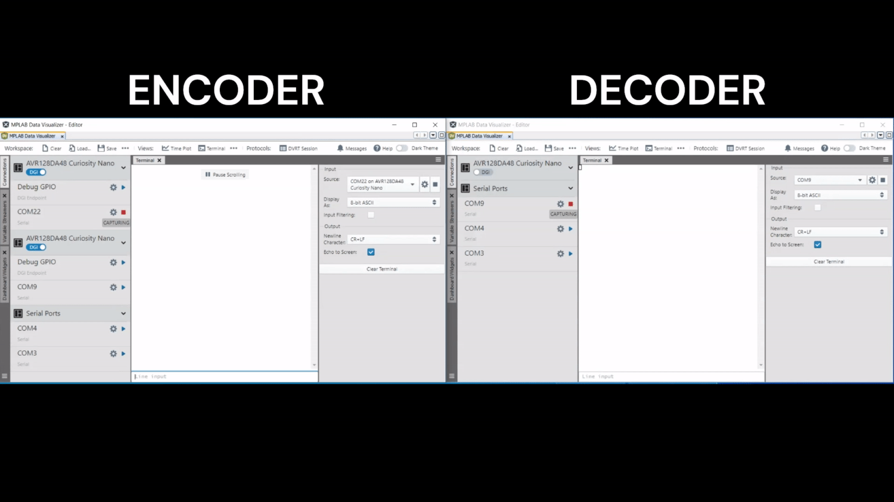

<!-- Please do not change this html logo with link -->

# Bi-Phase Encoder with Configurable Bitrate Based on CLB Using the PIC16F13145 Microcontroller with MCC Melody

The repository contains the Bi-Phase Encoder, an MPLAB® X project, using Core Independent Peripherals (CIPs) by following the interaction between Custom Logic Block (CLB), Serial Peripheral Interface (SPI) and Universal Asynchronous Receiver-Transmitter (UART) peripherals.

The CLB peripheral is a collection of logic elements that can be programmed to perform a wide variety of digital logic functions. The logic function may be completely combinatorial, sequential, or a combination of the two, enabling users to incorporate hardware-based custom logic into their applications.

The Bi-Phase Mark Code (BMC) combines both data and clock in a single signal. One clock cycle is a BMC bit period. A transition always occurs at the beginning of each bit period. A logic `1` is represented by a transition (rising or falling edge) in the middle of the bit period and a logic `0` is represented by no transition in the middle of the period. A BMC encoder accepts a data signal and clock signal as inputs and produces a single BMC-encoded output. A BMC decoder accepts a BMC-encoded signal as the input and produces two outputs: data and clock. BMC is used in standards such as the USB 3.1 Power Delivery Specification CC signaling, AES3 digital audio or S/PDIF audio. The figure below presents an example:

 

## Related Documentation

More details and code examples on the PIC16F13145 can be found at the following links:

- [PIC16F13145 Product Page](https://www.microchip.com/en-us/product/PIC16F13145?utm_source=GitHub&utm_medium=TextLink&utm_campaign=MCU8_MMTCha_PIC16F13145&utm_content=pic16f13145-biphase-encoder-mplab-mcc&utm_bu=MCU08)
- [PIC16F13145 Code Examples on Discover](https://mplab-discover.microchip.com/v2?dsl=PIC16F13145)
- [PIC16F13145 Code Examples on GitHub](https://github.com/microchip-pic-avr-examples/?q=PIC16F13145)
- [Bi-Phase Decoder with Configurable Bitrate Based on CLB Using the PIC16F13145 Microcontroller with MCC Melody](https://github.com/microchip-pic-avr-examples/pic16f13145-biphase-decoder-mplab-mcc)
- [Bi-Phase Encoder and Decoder - Use Cases for CIPs Using the AVR128DA48 Microcontroller with MCC Melody](https://github.com/microchip-pic-avr-examples/avr128da48-cnano-biphase-mplab-mcc)

## Software Used

- [MPLAB X IDE v6.20 or newer](https://www.microchip.com/en-us/tools-resources/develop/mplab-x-ide?utm_source=GitHub&utm_medium=TextLink&utm_campaign=MCU8_MMTCha_PIC16F13145&utm_content=pic16f13145-biphase-encoder-mplab-mcc&utm_bu=MCU08)
- [MPLAB® XC8 v2.46 or newer](https://www.microchip.com/en-us/tools-resources/develop/mplab-xc-compilers?utm_source=GitHub&utm_medium=TextLink&utm_campaign=MCU8_MMTCha_PIC16F13145&utm_content=pic16f13145-biphase-encoder-mplab-mcc&utm_bu=MCU08)
- [PIC16F1xxxx_DFP v1.25.389 or newer](https://packs.download.microchip.com/)

## Hardware Used

- The [PIC16F13145 Curiosity Nano Development board](https://www.microchip.com/en-us/development-tool/EV06M52A?utm_source=GitHub&utm_medium=TextLink&utm_campaign=MCU8_MMTCha_PIC16F13145&utm_content=pic16f13145-biphase-encoder-mplab-mcc&utm_bu=MCU08) is used as a test platform:
   

## Operation

To program the Curiosity Nano board with this MPLAB X project, follow the steps provided in the [How to Program the Curiosity Nano Board](#how-to-program-the-curiosity-nano-board) chapter.  

## Concept

This project is an implementation of a Bi-Phase encoder using CIPs by following the interaction between CLB, SPI, and UART peripherals. The raw data is received via serial communication, encoded using the circuit composed into the CLB peripheral mentioned above and sent through a single data wire. The CLB circuit is captured in the figure below:

 

The raw data is received via serial communication by the UART peripheral. This data is then stored in a buffer and used as input for the SPI peripheral which generates Non-Return-to-Zero (NRZ) data signal and a clock signal. Those signals are selected as inputs for the circuit composed inside the CLB peripheral which outputs the Bi-Phase encoded signal. A First-In-First-Out (FIFO) buffer mechanism is used from the generated libraries for UART peripheral to facilitate the data storage and minimize data loss.

After initializing all the peripherals, a start byte is sent for calibration purposes. The data received from the PC terminal is received by the UART peripheral and stored into the internal `eusart1RxBuffer` via receive interrupt. In the main function, data from the receive buffer is read byte by byte until the end and follows the flowchart below. A start byte and a stop byte describe each message stored into the internal buffer. A delay, `GAP_DURATION`, is needed between the start byte and the first read byte from the PC terminal to avoid the scenario when the FIFO buffer is empty.

For this example, the SPI peripheral can be initialized in multiple configurations, so the frequency of the encoded message can be chosen between different predefined values: 31.25 kHz, 62.5 kHz, 125 kHz, 250 kHz or 500 kHz.

## Setup

The following peripheral and clock configurations are set up using the MPLAB Code Configurator (MCC) Melody for the PIC16F13145:

1. Configuration Bits:

   - CONFIG1:
     - External Oscillator mode selection bits: Oscillator not enabled
     - Power-up default value for COSC bits: HFINTOSC (1MHz)
   - CONFIG2:
     - Brown-out reset enable bits: Brown-out reset disabled
   - CONFIG3:
     - WDT operating mode: WDT Disabled, SEN is ignored

    

2. Clock Control:

   - Clock Source: HFINTOSC
   - HF Internal Clock: 32_MHz
   - Clock Divider: 4
      

3. MSSP and SPI:

   - Serial Protocol: SPI
     - Mode: Host
     - SPI Mode: SPI Mode 1
     - User Configurations:
       - Config Name: HOST_CONFIG_31k25
         - Requested Speed (kHz): 31.25 kHz
       - Config Name: HOST_CONFIG_62k5
         - Requested Speed (kHz): 62.5 kHz
       - Config Name: HOST_CONFIG_125k
         - Requested Speed (kHz): 125 kHz
       - Config Name: HOST_CONFIG_250k
         - Requested Speed (kHz): 250 kHz
       - Config Name: HOST_CONFIG_500
         - Requested Speed (kHz): 500 kHz

    

4. CLB:

   - Enable CLB: Enabled
   - Clock Selection: HFINTOSC
   - Clock Divider: Divide clock source by 8
      

5. CRC:

   - Auto-configured by CLB

6. NVM:

   - Auto-configured by CLB

7. UART1:

   - Requested Baudrate: 38400
   - Data Size: 8
   - Interrupt Driven: Enabled
   - Software Receive Buffer Size: 128
   - Receive Enable: Enabled
   - Serial Port Enable: Enabled
   - RCI Interrupt Enable: Enabled
       

8. Pin Grid View:
   - EUSART1 RX1: RC5 (Data from terminal)
   - CLBPPSOUT0: RB7 (Encoded Message)
      

## Demo

In the demo, the `Microchip!` message was inserted by the user in the terminal. Pin RB7 - BMC out (the output pin for the Bi-Phase encoded signal) is visualized using a logic analyzer.

 

To use the embedded decoder from the Logic software, the next analyzers settings must be set:
 

Also, the `Microchip!` message was inserted by the user in the terminal. The output pin of the encoder platform (left side), BMC out (the output pin for the Bi-Phase encoded signal), is connected to the input pin of the decoder board and it is visualized using MPLAB Data Visualizer plug-in.

 

## Summary

This example demonstrates the capabilities of the CLB, a CIP, that can encode a message from the SPI and UART modules.

## How to Program the Curiosity Nano Board

This chapter demonstrates how to use the MPLAB X IDE to program a PIC® device with an `Example_Project.X`. This is applicable to other projects.

1.  Connect the board to the PC.

2.  Open the `Example_Project.X` project in MPLAB X IDE.

3.  Set the `Example_Project.X` project as main project.
     Right click the project in the **Projects** tab and click **Set as Main Project**.
     

4.  Clean and build the `Example_Project.X` project.
     Right click the `Example_Project.X` project and select **Clean and Build**.
     

5.  Select **PICxxxxx Curiosity Nano** in the Connected Hardware Tool section of the project settings:
     Right click the project and click **Properties**.
     Click the arrow under the Connected Hardware Tool.
     Select **PICxxxxx Curiosity Nano** (click the **SN**), click **Apply** and then click **OK**:
     

6.  Program the project to the board.
     Right click the project and click **Make and Program Device**.
     

 

---

## Menu

- [Back to Top](#bi-phase-encoder-with-configurable-bitrate-based-on-clb-using-the-pic16f13145-microcontroller-with-mcc-melody)
- [Back to Related Documentation](#related-documentation)
- [Back to Software Used](#software-used)
- [Back to Hardware Used](#hardware-used)
- [Back to Operation](#operation)
- [Back to Concept](#concept)
- [Back to Setup](#setup)
- [Back to Demo](#demo)
- [Back to Summary](#summary)
- [Back to How to Program the Curiosity Nano Board](#how-to-program-the-curiosity-nano-board)
